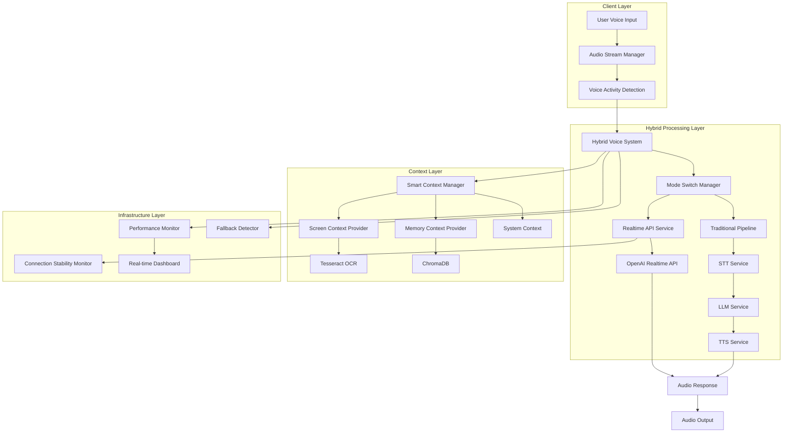
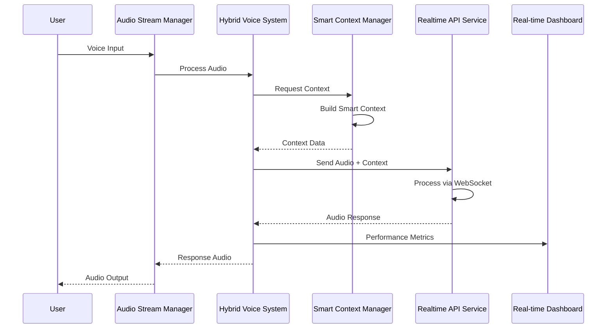
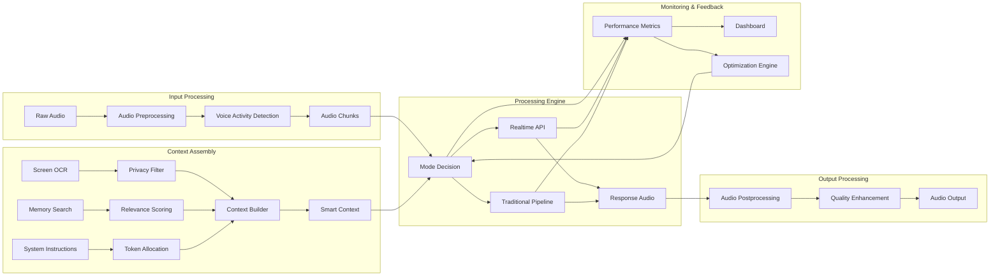

# Developer Documentation

Comprehensive developer guide for Sovereign 4.0 Voice Assistant with Realtime API integration.

## Table of Contents

1. [Architecture Overview](#architecture-overview)
2. [System Components](#system-components)
3. [Development Setup](#development-setup)
4. [Code Structure](#code-structure)
5. [API Integration Patterns](#api-integration-patterns)
6. [Testing Guidelines](#testing-guidelines)
7. [Performance Considerations](#performance-considerations)
8. [Deployment Architecture](#deployment-architecture)
9. [Contributing Guidelines](#contributing-guidelines)
10. [Advanced Topics](#advanced-topics)

---

## Architecture Overview

### High-Level System Architecture



### Component Interaction Flow



### Data Flow Architecture



---

## System Components

### Core Components

#### 1. Hybrid Voice System
**Location**: `assistant/hybrid_voice_system.py`

The central orchestrator that manages the entire voice processing pipeline.

```python
class HybridVoiceSystem:
    """
    Main orchestrator for voice processing with intelligent mode switching.
    
    Responsibilities:
    - Coordinate between Realtime API and traditional pipeline
    - Manage mode switching based on performance conditions
    - Handle error recovery and fallback scenarios
    - Integrate with smart context management
    """
    
    def __init__(self, config_manager: ConfigManager):
        self.config = config_manager
        self.current_mode = "realtime"
        
        # Initialize subsystems
        self.realtime_service = RealtimeVoiceService(config_manager)
        self.traditional_pipeline = VoicePipeline(config_manager)
        self.context_manager = SmartContextManager(config_manager)
        self.mode_switcher = ModeSwitchManager(config_manager)
        
    async def process_voice_input(self, audio_data: bytes) -> Optional[bytes]:
        """
        Main processing method that routes audio through appropriate pipeline.
        
        Args:
            audio_data: Raw audio bytes from microphone
            
        Returns:
            Processed audio response or None on error
        """
        # Build context
        context = await self.context_manager.build_context()
        
        # Process through current mode
        if self.current_mode == "realtime":
            return await self._process_realtime(audio_data, context)
        else:
            return await self._process_traditional(audio_data, context)
```

#### 2. Smart Context Manager
**Location**: `assistant/smart_context_manager.py`

Intelligent context management with priority-based token allocation.

```python
class SmartContextManager:
    """
    Manages context building with intelligent prioritization.
    
    Features:
    - 4-tier priority system for token allocation
    - Relevance scoring for content filtering
    - Context compression for token efficiency
    - Caching for performance optimization
    """
    
    def __init__(self, config_manager: ConfigManager):
        self.config = config_manager
        self.token_budget = config_manager.get('smart_context.token_budget', 32000)
        
        # Initialize components
        self.token_counter = TokenCounter()
        self.relevance_scorer = RelevanceScorer()
        self.context_compressor = ContextCompressor()
        self.cache_manager = ContextCacheManager()
        
    async def build_context(self, 
                          query: str = "",
                          include_memory: bool = True,
                          include_screen: bool = True) -> Dict[str, Any]:
        """
        Build optimized context for the given query.
        
        Args:
            query: User query or empty for general context
            include_memory: Whether to include conversation memory
            include_screen: Whether to include screen content
            
        Returns:
            Optimized context dictionary with token allocation
        """
        # Check cache first
        cache_key = self._generate_cache_key(query, include_memory, include_screen)
        if cached_context := await self.cache_manager.get(cache_key):
            return cached_context
            
        # Build context components
        context_components = await self._gather_context_components(
            query, include_memory, include_screen
        )
        
        # Apply priority-based allocation
        allocated_context = await self._allocate_tokens(context_components)
        
        # Cache result
        await self.cache_manager.set(cache_key, allocated_context)
        
        return allocated_context
```

#### 3. Realtime API Service
**Location**: `assistant/realtime_voice.py`

Direct integration with OpenAI's Realtime API via WebSocket.

```python
class RealtimeVoiceService:
    """
    WebSocket-based interface to OpenAI Realtime API.
    
    Features:
    - Persistent WebSocket connection management
    - Real-time audio streaming
    - Event-based response handling
    - Connection health monitoring
    """
    
    def __init__(self, config_manager: ConfigManager):
        self.config = config_manager
        self.websocket = None
        self.connection_status = "disconnected"
        
        # Audio configuration
        self.sample_rate = config_manager.get('realtime_api.sample_rate', 24000)
        self.voice = config_manager.get('realtime_api.voice', 'alloy')
        
    async def connect(self) -> bool:
        """
        Establish WebSocket connection to OpenAI Realtime API.
        
        Returns:
            True if connection successful, False otherwise
        """
        try:
            headers = {
                "Authorization": f"Bearer {self.config.get_api_key('openai')}",
                "OpenAI-Beta": "realtime=v1"
            }
            
            self.websocket = await websockets.connect(
                "wss://api.openai.com/v1/realtime?model=gpt-4o-realtime-preview",
                extra_headers=headers,
                ping_interval=30,
                ping_timeout=10
            )
            
            # Send session configuration
            await self._configure_session()
            
            self.connection_status = "connected"
            return True
            
        except Exception as e:
            logger.error(f"Failed to connect to Realtime API: {e}")
            self.connection_status = "failed"
            return False
    
    async def process_audio(self, audio_data: bytes, context: Dict) -> bytes:
        """
        Process audio through Realtime API.
        
        Args:
            audio_data: Raw audio bytes
            context: Smart context for the request
            
        Returns:
            Processed audio response
        """
        if not self.websocket:
            raise RuntimeError("Not connected to Realtime API")
        
        # Update context
        await self._update_context(context)
        
        # Send audio
        await self._send_audio_chunk(audio_data)
        
        # Receive response
        response_audio = await self._receive_audio_response()
        
        return response_audio
```

### Support Components

#### 4. Audio Stream Manager
**Location**: `assistant/audio_stream_manager.py`

Optimized audio streaming for WebSocket communication.

```python
class AudioStreamManager:
    """
    Manages real-time audio streaming with optimal buffering.
    
    Features:
    - Low-latency audio buffering
    - Format conversion and resampling
    - Audio quality enhancement
    - Stream synchronization
    """
    
    def __init__(self, config_manager: ConfigManager):
        self.config = config_manager
        self.input_stream = None
        self.output_stream = None
        
        # Audio settings
        self.sample_rate = config_manager.get('audio.sample_rate', 24000)
        self.chunk_size = config_manager.get('audio.chunk_size', 1024)
        self.channels = config_manager.get('audio.channels', 1)
        
    async def start_streaming(self):
        """Initialize audio input/output streams."""
        
        # Initialize PyAudio
        self.audio = pyaudio.PyAudio()
        
        # Configure input stream
        self.input_stream = self.audio.open(
            format=pyaudio.paInt16,
            channels=self.channels,
            rate=self.sample_rate,
            input=True,
            frames_per_buffer=self.chunk_size,
            stream_callback=self._audio_input_callback
        )
        
        # Configure output stream
        self.output_stream = self.audio.open(
            format=pyaudio.paInt16,
            channels=self.channels,
            rate=self.sample_rate,
            output=True,
            frames_per_buffer=self.chunk_size
        )
        
    def _audio_input_callback(self, in_data, frame_count, time_info, status):
        """Process incoming audio data."""
        
        # Apply audio processing
        processed_audio = self._process_input_audio(in_data)
        
        # Queue for processing
        self.input_queue.put(processed_audio)
        
        return (None, pyaudio.paContinue)
```

#### 5. Connection Stability Monitor
**Location**: `assistant/connection_stability_monitor.py`

Monitors and maintains WebSocket connection health.

```python
class ConnectionStabilityMonitor:
    """
    Monitors WebSocket connection health and stability.
    
    Features:
    - Continuous health monitoring
    - Automatic reconnection with exponential backoff
    - Connection quality metrics
    - Circuit breaker pattern implementation
    """
    
    def __init__(self, config_manager: ConfigManager):
        self.config = config_manager
        self.connection_metrics = {}
        self.circuit_breaker = CircuitBreaker()
        
    async def start_monitoring(self, websocket):
        """Start monitoring the WebSocket connection."""
        
        self.websocket = websocket
        self.monitoring = True
        
        # Start monitoring tasks
        asyncio.create_task(self._ping_monitor())
        asyncio.create_task(self._latency_monitor())
        asyncio.create_task(self._quality_monitor())
        
    async def _ping_monitor(self):
        """Monitor connection with periodic pings."""
        
        ping_interval = self.config.get('connection_stability.ping_interval', 30.0)
        
        while self.monitoring:
            try:
                start_time = time.time()
                pong_waiter = await self.websocket.ping()
                await pong_waiter
                
                # Record latency
                latency = (time.time() - start_time) * 1000
                self._record_ping_latency(latency)
                
            except Exception as e:
                logger.warning(f"Ping failed: {e}")
                await self._handle_connection_issue()
                
            await asyncio.sleep(ping_interval)
```

---

## Development Setup

### Prerequisites

```bash
# Python 3.11+ (required)
python --version  # Should be 3.11 or higher

# System dependencies
# macOS
brew install tesseract portaudio ffmpeg

# Ubuntu/Debian
sudo apt-get install tesseract-ocr portaudio19-dev ffmpeg

# Windows
# Install from respective websites or use chocolatey
choco install tesseract portaudio ffmpeg
```

### Environment Setup

```bash
# Clone repository
git clone <repository-url>
cd sovereign-4.0

# Create virtual environment
python -m venv venv
source venv/bin/activate  # Linux/macOS
# or
venv\Scripts\activate  # Windows

# Install dependencies
pip install -r requirements.txt
pip install -r requirements-dev.txt  # Development dependencies

# Install pre-commit hooks
pre-commit install

# Configure environment
cp .env.example .env
# Edit .env with your API keys
```

### Development Configuration

Create `config/sovereign.dev.yaml`:

```yaml
# Development configuration
app:
  mode: "hybrid"
  debug: true

audio:
  sample_rate: 16000  # Lower for faster development
  chunk_size: 512
  processing:
    noise_reduction: false  # Disable for speed

smart_context:
  token_budget: 8000  # Smaller for faster iteration
  cache:
    ttl_seconds: 60  # Short cache for development

monitoring:
  enabled: true
  collection:
    interval_seconds: 0.5  # Frequent for debugging

logging:
  level: "DEBUG"
  console:
    enabled: true
    colored: true
```

### IDE Configuration

#### VS Code Setup

Create `.vscode/settings.json`:

```json
{
    "python.defaultInterpreterPath": "./venv/bin/python",
    "python.linting.enabled": true,
    "python.linting.pylintEnabled": true,
    "python.formatting.provider": "black",
    "python.testing.pytestEnabled": true,
    "python.testing.pytestArgs": ["tests/"],
    "files.exclude": {
        "**/__pycache__": true,
        "**/*.pyc": true,
        ".pytest_cache": true
    }
}
```

Create `.vscode/launch.json`:

```json
{
    "version": "0.2.0",
    "configurations": [
        {
            "name": "Run Sovereign Assistant",
            "type": "python",
            "request": "launch",
            "program": "assistant/main.py",
            "args": ["--config", "config/sovereign.dev.yaml"],
            "console": "integratedTerminal",
            "cwd": "${workspaceFolder}",
            "env": {
                "PYTHONPATH": "${workspaceFolder}"
            }
        },
        {
            "name": "Debug Tests",
            "type": "python",
            "request": "launch",
            "module": "pytest",
            "args": ["tests/", "-v", "--tb=short"],
            "console": "integratedTerminal",
            "cwd": "${workspaceFolder}"
        }
    ]
}
```

---

## Code Structure

### Project Organization

```
sovereign-4.0/
├── assistant/                    # Core application code
│   ├── __init__.py
│   ├── main.py                  # Application entry point
│   ├── config_manager.py        # Configuration management
│   ├── hybrid_voice_system.py   # Main orchestrator
│   ├── realtime_voice.py        # Realtime API service
│   ├── smart_context_manager.py # Context management
│   ├── screen_context_provider.py # Screen OCR
│   ├── memory_context_provider.py # Memory management
│   ├── audio_stream_manager.py  # Audio streaming
│   ├── connection_stability_monitor.py # Connection health
│   ├── mode_switch_manager.py   # Mode switching logic
│   ├── fallback_detector.py     # Performance monitoring
│   └── realtime_metrics_collector.py # Metrics collection
│
├── tests/                       # Test suite
│   ├── __init__.py
│   ├── conftest.py             # Test configuration
│   ├── fixtures/               # Test fixtures and utilities
│   ├── unit/                   # Unit tests
│   ├── integration/            # Integration tests
│   ├── e2e/                    # End-to-end tests
│   └── performance/            # Performance tests
│
├── config/                     # Configuration files
│   ├── sovereign.yaml          # Main configuration
│   ├── sovereign.dev.yaml      # Development config
│   ├── sovereign.prod.yaml     # Production config
│   └── sovereign.test.yaml     # Testing config
│
├── docs/                       # Documentation
│   ├── api_documentation.md
│   ├── configuration_reference.md
│   ├── troubleshooting_guide.md
│   ├── migration_guide.md
│   ├── performance_tuning_guide.md
│   └── developer_documentation.md
│
├── dashboard/                  # Web dashboard
│   ├── static/                # Static assets
│   └── templates/             # HTML templates
│
├── scripts/                   # Utility scripts
│   ├── migrate_config.py      # Configuration migration
│   ├── performance_test.py    # Performance testing
│   └── diagnostic.py          # System diagnostics
│
└── deployment/               # Deployment configurations
    ├── docker/               # Docker configurations
    ├── k8s/                  # Kubernetes manifests
    └── systemd/              # SystemD service files
```

### Coding Standards

#### Python Style Guide

Follow PEP 8 with these specific guidelines:

```python
# Imports organization
import asyncio
import logging
from typing import Dict, List, Optional, Any

# Third-party imports
import websockets
import pyaudio
import numpy as np

# Local imports
from assistant.config_manager import ConfigManager
from assistant.audio_stream_manager import AudioStreamManager

# Class structure
class ExampleService:
    """
    Brief description of the service.
    
    Longer description explaining the purpose, key features,
    and usage patterns.
    
    Attributes:
        config: Configuration manager instance
        state: Current service state
    """
    
    def __init__(self, config_manager: ConfigManager):
        """
        Initialize the service.
        
        Args:
            config_manager: Configuration manager instance
        """
        self.config = config_manager
        self.state = "initialized"
        self.logger = logging.getLogger(__name__)
        
    async def async_method(self, param: str) -> Optional[Dict[str, Any]]:
        """
        Example async method with proper typing.
        
        Args:
            param: Description of parameter
            
        Returns:
            Dictionary with results or None on error
            
        Raises:
            ValueError: If param is invalid
            ConnectionError: If service unavailable
        """
        if not param:
            raise ValueError("Parameter cannot be empty")
            
        try:
            result = await self._internal_operation(param)
            return {"status": "success", "data": result}
            
        except Exception as e:
            self.logger.error(f"Operation failed: {e}")
            return None
    
    def _internal_operation(self, param: str) -> str:
        """Internal helper method (private)."""
        return f"processed_{param}"
```

#### Error Handling Patterns

```python
# Standard error handling pattern
async def robust_operation(self, data: bytes) -> Optional[bytes]:
    """
    Perform operation with comprehensive error handling.
    """
    try:
        # Validate input
        if not data:
            raise ValueError("Input data cannot be empty")
        
        # Perform operation
        result = await self._process_data(data)
        
        # Validate result
        if not self._validate_result(result):
            raise ProcessingError("Invalid result from processing")
        
        return result
        
    except ValueError as e:
        self.logger.warning(f"Invalid input: {e}")
        return None
        
    except ConnectionError as e:
        self.logger.error(f"Connection failed: {e}")
        # Trigger fallback mechanism
        await self._handle_connection_failure()
        return None
        
    except ProcessingError as e:
        self.logger.error(f"Processing failed: {e}")
        # Record error for analysis
        await self._record_processing_error(e)
        return None
        
    except Exception as e:
        self.logger.exception(f"Unexpected error: {e}")
        # Critical error - may need system restart
        await self._handle_critical_error(e)
        return None
```

#### Async/Await Patterns

```python
# Proper async context management
class AsyncResourceManager:
    """Manages async resources with proper cleanup."""
    
    async def __aenter__(self):
        await self.initialize()
        return self
    
    async def __aexit__(self, exc_type, exc_val, exc_tb):
        await self.cleanup()
    
    async def initialize(self):
        """Initialize async resources."""
        self.websocket = await websockets.connect(self.url)
        self.audio_stream = await self._setup_audio_stream()
    
    async def cleanup(self):
        """Cleanup async resources."""
        if self.websocket:
            await self.websocket.close()
        if self.audio_stream:
            await self.audio_stream.stop()

# Usage pattern
async def use_resources():
    async with AsyncResourceManager() as manager:
        result = await manager.process_data(data)
        return result
```

---

## API Integration Patterns

### Realtime API Integration

```python
class RealtimeAPIClient:
    """
    Production-ready Realtime API client with full error handling.
    """
    
    def __init__(self, config_manager: ConfigManager):
        self.config = config_manager
        self.websocket = None
        self.session_id = None
        self.event_handlers = {}
        
    async def connect(self) -> bool:
        """Establish connection with retry logic."""
        
        max_retries = self.config.get('realtime_api.max_retries', 3)
        retry_delay = self.config.get('realtime_api.retry_delay', 2.0)
        
        for attempt in range(max_retries):
            try:
                await self._attempt_connection()
                await self._initialize_session()
                return True
                
            except Exception as e:
                logger.warning(f"Connection attempt {attempt + 1} failed: {e}")
                if attempt < max_retries - 1:
                    await asyncio.sleep(retry_delay * (2 ** attempt))
                    
        return False
    
    async def _attempt_connection(self):
        """Single connection attempt."""
        
        headers = {
            "Authorization": f"Bearer {self.config.get_api_key('openai')}",
            "OpenAI-Beta": "realtime=v1"
        }
        
        self.websocket = await websockets.connect(
            "wss://api.openai.com/v1/realtime?model=gpt-4o-realtime-preview",
            extra_headers=headers,
            ping_interval=30,
            ping_timeout=10,
            max_size=10**7,  # 10MB max message size
            compression=None  # Disable compression for audio
        )
        
    async def send_audio_chunk(self, audio_data: bytes):
        """Send audio chunk with proper encoding."""
        
        # Encode audio as base64
        import base64
        audio_base64 = base64.b64encode(audio_data).decode('utf-8')
        
        message = {
            "type": "input_audio_buffer.append",
            "audio": audio_base64
        }
        
        await self.websocket.send(json.dumps(message))
    
    async def listen_for_events(self):
        """Listen for events from the API."""
        
        try:
            async for message in self.websocket:
                event = json.loads(message)
                await self._handle_event(event)
                
        except websockets.exceptions.ConnectionClosed:
            logger.warning("WebSocket connection closed")
            await self._handle_disconnection()
            
        except Exception as e:
            logger.error(f"Error listening for events: {e}")
            raise
    
    async def _handle_event(self, event: Dict[str, Any]):
        """Handle incoming events from the API."""
        
        event_type = event.get("type")
        
        if event_type == "session.created":
            self.session_id = event.get("session", {}).get("id")
            logger.info(f"Session created: {self.session_id}")
            
        elif event_type == "response.audio.delta":
            # Handle audio response chunk
            audio_data = event.get("delta", "")
            await self._process_audio_response(audio_data)
            
        elif event_type == "error":
            error = event.get("error", {})
            logger.error(f"API error: {error}")
            await self._handle_api_error(error)
            
        # Call registered handlers
        if event_type in self.event_handlers:
            await self.event_handlers[event_type](event)
```

### Context Management Integration

```python
class ContextIntegrator:
    """
    Integrates various context sources for AI processing.
    """
    
    def __init__(self, config_manager: ConfigManager):
        self.config = config_manager
        self.providers = {
            'screen': ScreenContextProvider(config_manager),
            'memory': MemoryContextProvider(config_manager),
            'system': SystemContextProvider(config_manager)
        }
        
    async def build_integrated_context(self, query: str) -> Dict[str, Any]:
        """
        Build comprehensive context from all sources.
        """
        
        context = {
            'query': query,
            'timestamp': datetime.now().isoformat(),
            'sources': {}
        }
        
        # Determine which contexts are needed
        context_needs = await self._analyze_context_needs(query)
        
        # Gather context from relevant providers
        tasks = []
        for provider_name, needed in context_needs.items():
            if needed and provider_name in self.providers:
                task = self._get_provider_context(provider_name, query)
                tasks.append((provider_name, task))
        
        # Execute context gathering concurrently
        results = await asyncio.gather(*[task for _, task in tasks], return_exceptions=True)
        
        # Process results
        for (provider_name, _), result in zip(tasks, results):
            if isinstance(result, Exception):
                logger.warning(f"Context provider {provider_name} failed: {result}")
                context['sources'][provider_name] = {'error': str(result)}
            else:
                context['sources'][provider_name] = result
        
        return context
    
    async def _analyze_context_needs(self, query: str) -> Dict[str, bool]:
        """
        Analyze query to determine which context sources are needed.
        """
        
        query_lower = query.lower()
        
        return {
            'screen': any(keyword in query_lower for keyword in [
                'screen', 'see', 'display', 'window', 'show', 'visible'
            ]),
            'memory': any(keyword in query_lower for keyword in [
                'remember', 'earlier', 'before', 'previous', 'mentioned'
            ]),
            'system': True  # Always include system context
        }
    
    async def _get_provider_context(self, provider_name: str, query: str) -> Dict[str, Any]:
        """Get context from specific provider."""
        
        provider = self.providers[provider_name]
        
        if provider_name == 'screen':
            return await provider.get_current_screen_context()
        elif provider_name == 'memory':
            return await provider.search_relevant_memories(query)
        elif provider_name == 'system':
            return await provider.get_system_context()
        else:
            raise ValueError(f"Unknown provider: {provider_name}")
```

---

## Testing Guidelines

### Test Structure

```python
# tests/unit/test_hybrid_voice_system.py
import pytest
import asyncio
from unittest.mock import AsyncMock, MagicMock, patch

from assistant.hybrid_voice_system import HybridVoiceSystem
from assistant.config_manager import ConfigManager

class TestHybridVoiceSystem:
    """Test suite for HybridVoiceSystem."""
    
    @pytest.fixture
    async def hybrid_system(self, mock_config_manager):
        """Create HybridVoiceSystem instance for testing."""
        
        system = HybridVoiceSystem(mock_config_manager)
        
        # Mock subsystems
        system.realtime_service = AsyncMock()
        system.traditional_pipeline = AsyncMock()
        system.context_manager = AsyncMock()
        
        return system
    
    @pytest.mark.asyncio
    async def test_process_voice_input_realtime_mode(self, hybrid_system):
        """Test voice processing in realtime mode."""
        
        # Setup
        test_audio = b"test audio data"
        expected_response = b"response audio data"
        
        hybrid_system.current_mode = "realtime"
        hybrid_system.context_manager.build_context.return_value = {"context": "test"}
        hybrid_system.realtime_service.process_audio.return_value = expected_response
        
        # Execute
        result = await hybrid_system.process_voice_input(test_audio)
        
        # Verify
        assert result == expected_response
        hybrid_system.context_manager.build_context.assert_called_once()
        hybrid_system.realtime_service.process_audio.assert_called_once_with(
            test_audio, {"context": "test"}
        )
    
    @pytest.mark.asyncio
    async def test_fallback_to_traditional_on_realtime_failure(self, hybrid_system):
        """Test automatic fallback when realtime processing fails."""
        
        # Setup
        test_audio = b"test audio data"
        expected_response = b"fallback response"
        
        hybrid_system.current_mode = "realtime"
        hybrid_system.context_manager.build_context.return_value = {"context": "test"}
        hybrid_system.realtime_service.process_audio.side_effect = Exception("API failure")
        hybrid_system.traditional_pipeline.process_audio.return_value = expected_response
        
        # Execute
        result = await hybrid_system.process_voice_input(test_audio)
        
        # Verify
        assert result == expected_response
        assert hybrid_system.current_mode == "traditional"
        hybrid_system.traditional_pipeline.process_audio.assert_called_once()
```

### Integration Testing

```python
# tests/integration/test_realtime_api_integration.py
import pytest
import asyncio
from unittest.mock import patch, AsyncMock

from assistant.realtime_voice import RealtimeVoiceService
from assistant.config_manager import ConfigManager

@pytest.mark.integration
class TestRealtimeAPIIntegration:
    """Integration tests for Realtime API."""
    
    @pytest.fixture
    async def realtime_service(self, integration_config):
        """Create RealtimeVoiceService for integration testing."""
        
        service = RealtimeVoiceService(integration_config)
        return service
    
    @pytest.mark.asyncio
    async def test_connection_establishment(self, realtime_service):
        """Test establishing connection to Realtime API."""
        
        # Skip if no API key available
        if not realtime_service.config.get_api_key('openai'):
            pytest.skip("OpenAI API key not available")
        
        # Test connection
        connected = await realtime_service.connect()
        
        try:
            assert connected
            assert realtime_service.connection_status == "connected"
            
        finally:
            # Cleanup
            await realtime_service.disconnect()
    
    @pytest.mark.asyncio
    async def test_audio_processing_end_to_end(self, realtime_service):
        """Test complete audio processing pipeline."""
        
        if not realtime_service.config.get_api_key('openai'):
            pytest.skip("OpenAI API key not available")
        
        # Generate test audio
        test_audio = self._generate_test_audio()
        test_context = {"system": "You are a helpful assistant"}
        
        await realtime_service.connect()
        
        try:
            # Process audio
            response = await realtime_service.process_audio(test_audio, test_context)
            
            # Verify response
            assert response is not None
            assert isinstance(response, bytes)
            assert len(response) > 0
            
        finally:
            await realtime_service.disconnect()
    
    def _generate_test_audio(self) -> bytes:
        """Generate test audio data."""
        
        import numpy as np
        
        # Generate 1 second of test audio at 24kHz
        sample_rate = 24000
        duration = 1.0
        frequency = 440  # A4 note
        
        t = np.linspace(0, duration, int(sample_rate * duration))
        audio = np.sin(2 * np.pi * frequency * t)
        
        # Convert to 16-bit PCM
        audio_int16 = (audio * 32767).astype(np.int16)
        return audio_int16.tobytes()
```

### Performance Testing

```python
# tests/performance/test_latency_benchmarks.py
import pytest
import time
import statistics
from typing import List

from assistant.hybrid_voice_system import HybridVoiceSystem

@pytest.mark.performance
class TestLatencyBenchmarks:
    """Performance benchmarks for latency measurements."""
    
    @pytest.fixture
    async def benchmark_system(self, mock_config_manager):
        """Create system optimized for benchmarking."""
        
        # Configure for performance testing
        mock_config_manager.config['performance'] = {
            'targets': {'latency_ms': 300},
            'optimization': {
                'parallel_processing': True,
                'async_operations': True,
                'low_latency_mode': True
            }
        }
        
        system = HybridVoiceSystem(mock_config_manager)
        await system.start()
        return system
    
    @pytest.mark.asyncio
    async def test_end_to_end_latency_benchmark(self, benchmark_system):
        """Benchmark end-to-end processing latency."""
        
        latencies = []
        test_audio = self._generate_test_audio()
        
        # Warm up
        for _ in range(5):
            await benchmark_system.process_voice_input(test_audio)
        
        # Benchmark
        for _ in range(50):
            start_time = time.time()
            await benchmark_system.process_voice_input(test_audio)
            latency_ms = (time.time() - start_time) * 1000
            latencies.append(latency_ms)
        
        # Analyze results
        avg_latency = statistics.mean(latencies)
        p95_latency = statistics.quantiles(latencies, n=20)[18]  # 95th percentile
        p99_latency = statistics.quantiles(latencies, n=100)[98]  # 99th percentile
        
        # Report results
        print(f"\nLatency Benchmark Results:")
        print(f"Average: {avg_latency:.1f}ms")
        print(f"P95: {p95_latency:.1f}ms")
        print(f"P99: {p99_latency:.1f}ms")
        
        # Assert performance targets
        assert avg_latency < 300, f"Average latency {avg_latency:.1f}ms exceeds target"
        assert p95_latency < 500, f"P95 latency {p95_latency:.1f}ms exceeds target"
    
    def _analyze_latency_distribution(self, latencies: List[float]) -> dict:
        """Analyze latency distribution for insights."""
        
        return {
            'count': len(latencies),
            'mean': statistics.mean(latencies),
            'median': statistics.median(latencies),
            'stdev': statistics.stdev(latencies),
            'min': min(latencies),
            'max': max(latencies),
            'p50': statistics.quantiles(latencies, n=2)[0],
            'p90': statistics.quantiles(latencies, n=10)[8],
            'p95': statistics.quantiles(latencies, n=20)[18],
            'p99': statistics.quantiles(latencies, n=100)[98]
        }
```

---

## Performance Considerations

### Optimization Strategies

#### 1. Async Programming Best Practices

```python
# Efficient async patterns
class OptimizedProcessor:
    """Example of optimized async processing."""
    
    async def process_concurrent_requests(self, requests: List[Dict]) -> List[Dict]:
        """Process multiple requests concurrently."""
        
        # Process in batches to avoid overwhelming the system
        batch_size = 10
        results = []
        
        for i in range(0, len(requests), batch_size):
            batch = requests[i:i + batch_size]
            
            # Process batch concurrently
            tasks = [self._process_single_request(req) for req in batch]
            batch_results = await asyncio.gather(*tasks, return_exceptions=True)
            
            # Handle results and exceptions
            for result in batch_results:
                if isinstance(result, Exception):
                    logger.error(f"Request failed: {result}")
                    results.append({"error": str(result)})
                else:
                    results.append(result)
        
        return results
    
    async def _process_single_request(self, request: Dict) -> Dict:
        """Process a single request with timeout."""
        
        try:
            # Set timeout for individual request
            return await asyncio.wait_for(
                self._actual_processing(request),
                timeout=5.0
            )
        except asyncio.TimeoutError:
            raise ProcessingError("Request timed out")
```

#### 2. Memory Management

```python
class MemoryOptimizedComponent:
    """Component with optimized memory usage."""
    
    def __init__(self, config_manager: ConfigManager):
        self.config = config_manager
        self.cache = {}
        self.cache_max_size = config_manager.get('cache.max_size', 100)
        
        # Memory monitoring
        self.memory_threshold = config_manager.get('memory.threshold_mb', 512)
        self._setup_memory_monitoring()
    
    def _setup_memory_monitoring(self):
        """Setup periodic memory monitoring."""
        
        async def monitor_memory():
            while True:
                memory_usage = self._get_memory_usage()
                if memory_usage > self.memory_threshold:
                    await self._cleanup_memory()
                await asyncio.sleep(30)  # Check every 30 seconds
        
        asyncio.create_task(monitor_memory())
    
    async def _cleanup_memory(self):
        """Cleanup memory when threshold exceeded."""
        
        # Clear cache
        self.cache.clear()
        
        # Force garbage collection
        import gc
        gc.collect()
        
        logger.info("Memory cleanup completed")
    
    def _get_memory_usage(self) -> float:
        """Get current memory usage in MB."""
        
        import psutil
        process = psutil.Process()
        return process.memory_info().rss / 1024 / 1024
```

#### 3. Connection Pooling

```python
class ConnectionPool:
    """Connection pool for WebSocket connections."""
    
    def __init__(self, config_manager: ConfigManager):
        self.config = config_manager
        self.pool = asyncio.Queue()
        self.pool_size = config_manager.get('connection_pool.size', 5)
        self.created_connections = 0
        
    async def initialize_pool(self):
        """Initialize connection pool."""
        
        for _ in range(self.pool_size):
            connection = await self._create_connection()
            await self.pool.put(connection)
            self.created_connections += 1
    
    async def get_connection(self):
        """Get connection from pool."""
        
        try:
            # Try to get existing connection
            connection = self.pool.get_nowait()
            
            # Verify connection is still valid
            if await self._is_connection_valid(connection):
                return connection
            else:
                # Create new connection if invalid
                return await self._create_connection()
                
        except asyncio.QueueEmpty:
            # Create new connection if pool empty
            return await self._create_connection()
    
    async def return_connection(self, connection):
        """Return connection to pool."""
        
        if await self._is_connection_valid(connection):
            try:
                self.pool.put_nowait(connection)
            except asyncio.QueueFull:
                # Pool is full, close connection
                await connection.close()
        else:
            await connection.close()
```

---

## Deployment Architecture

### Production Deployment

```yaml
# docker-compose.prod.yml
version: '3.8'

services:
  sovereign-assistant:
    image: sovereign:4.0
    deploy:
      replicas: 3
      resources:
        limits:
          cpus: '2.0'
          memory: 1G
        reservations:
          cpus: '1.0'
          memory: 512M
    environment:
      - SOVEREIGN_ENV=production
      - SOVEREIGN_MODE=hybrid
      - OPENAI_API_KEY=${OPENAI_API_KEY}
    volumes:
      - ./config:/app/config:ro
      - ./data:/app/data
      - ./logs:/app/logs
    ports:
      - "8080:8080"
    healthcheck:
      test: ["CMD", "python", "-c", "import requests; requests.get('http://localhost:8080/health')"]
      interval: 30s
      timeout: 10s
      retries: 3
    
  redis:
    image: redis:7-alpine
    deploy:
      resources:
        limits:
          memory: 256M
    volumes:
      - redis-data:/data
    
  prometheus:
    image: prom/prometheus:latest
    ports:
      - "9090:9090"
    volumes:
      - ./monitoring/prometheus.yml:/etc/prometheus/prometheus.yml
      - prometheus-data:/prometheus
    
  grafana:
    image: grafana/grafana:latest
    ports:
      - "3000:3000"
    environment:
      - GF_SECURITY_ADMIN_PASSWORD=${GRAFANA_PASSWORD}
    volumes:
      - grafana-data:/var/lib/grafana
      - ./monitoring/grafana:/etc/grafana/provisioning

volumes:
  redis-data:
  prometheus-data:
  grafana-data:
```

### Kubernetes Deployment

```yaml
# k8s/deployment.yaml
apiVersion: apps/v1
kind: Deployment
metadata:
  name: sovereign-assistant
  labels:
    app: sovereign-assistant
spec:
  replicas: 3
  selector:
    matchLabels:
      app: sovereign-assistant
  template:
    metadata:
      labels:
        app: sovereign-assistant
    spec:
      containers:
      - name: sovereign
        image: sovereign:4.0
        ports:
        - containerPort: 8080
        env:
        - name: SOVEREIGN_ENV
          value: "production"
        - name: OPENAI_API_KEY
          valueFrom:
            secretKeyRef:
              name: api-keys
              key: openai-api-key
        resources:
          requests:
            memory: "512Mi"
            cpu: "500m"
          limits:
            memory: "1Gi"
            cpu: "1000m"
        livenessProbe:
          httpGet:
            path: /health
            port: 8080
          initialDelaySeconds: 30
          periodSeconds: 10
        readinessProbe:
          httpGet:
            path: /ready
            port: 8080
          initialDelaySeconds: 5
          periodSeconds: 5
        volumeMounts:
        - name: config
          mountPath: /app/config
          readOnly: true
        - name: data
          mountPath: /app/data
      volumes:
      - name: config
        configMap:
          name: sovereign-config
      - name: data
        persistentVolumeClaim:
          claimName: sovereign-data
```

---

## Contributing Guidelines

### Development Workflow

1. **Fork and Clone**
   ```bash
   git clone https://github.com/yourusername/sovereign-4.0.git
   cd sovereign-4.0
   ```

2. **Create Feature Branch**
   ```bash
   git checkout -b feature/your-feature-name
   ```

3. **Development Setup**
   ```bash
   python -m venv venv
   source venv/bin/activate
   pip install -r requirements-dev.txt
   pre-commit install
   ```

4. **Make Changes**
   - Follow coding standards
   - Add comprehensive tests
   - Update documentation

5. **Test Changes**
   ```bash
   # Run tests
   python -m pytest tests/ -v
   
   # Check coverage
   python -m pytest tests/ --cov=assistant --cov-report=html
   
   # Run linting
   flake8 assistant/
   black assistant/
   ```

6. **Commit and Push**
   ```bash
   git add .
   git commit -m "feat: add new feature description"
   git push origin feature/your-feature-name
   ```

7. **Create Pull Request**
   - Provide clear description
   - Reference related issues
   - Include test results

### Code Review Process

1. **Automated Checks**
   - All tests must pass
   - Code coverage must be >90%
   - Linting must pass
   - Security scans must pass

2. **Manual Review**
   - Code quality and standards
   - Architecture consistency
   - Performance implications
   - Documentation completeness

3. **Approval Process**
   - Requires 2 approvals from maintainers
   - All conversations must be resolved
   - CI/CD pipeline must be green

---

## Advanced Topics

### Custom Extensions

```python
# Example: Custom context provider
class CustomContextProvider:
    """Template for creating custom context providers."""
    
    def __init__(self, config_manager: ConfigManager):
        self.config = config_manager
        self.name = "custom_provider"
        
    async def get_context(self, query: str) -> Dict[str, Any]:
        """
        Provide custom context for the given query.
        
        Args:
            query: User query
            
        Returns:
            Context dictionary
        """
        
        # Implement your custom context logic here
        context = {
            "provider": self.name,
            "timestamp": datetime.now().isoformat(),
            "data": await self._gather_custom_data(query)
        }
        
        return context
    
    async def _gather_custom_data(self, query: str) -> Any:
        """Implement your custom data gathering logic."""
        
        # Example: Call external API, database, etc.
        return {"custom": "data"}

# Register custom provider
from assistant.smart_context_manager import SmartContextManager

class ExtendedContextManager(SmartContextManager):
    """Extended context manager with custom providers."""
    
    def __init__(self, config_manager: ConfigManager):
        super().__init__(config_manager)
        
        # Add custom providers
        self.custom_providers = {
            'custom': CustomContextProvider(config_manager)
        }
    
    async def build_context(self, query: str, **kwargs) -> Dict[str, Any]:
        """Build context including custom providers."""
        
        # Get base context
        context = await super().build_context(query, **kwargs)
        
        # Add custom context if needed
        if self._needs_custom_context(query):
            custom_context = await self.custom_providers['custom'].get_context(query)
            context['custom'] = custom_context
        
        return context
```

### Plugin Architecture

```python
# Plugin interface
class SovereignPlugin:
    """Base class for Sovereign plugins."""
    
    def __init__(self, config_manager: ConfigManager):
        self.config = config_manager
        self.name = "base_plugin"
        self.version = "1.0.0"
    
    async def initialize(self):
        """Initialize the plugin."""
        pass
    
    async def process_audio_input(self, audio_data: bytes) -> bytes:
        """Process audio input (optional)."""
        return audio_data
    
    async def process_audio_output(self, audio_data: bytes) -> bytes:
        """Process audio output (optional)."""
        return audio_data
    
    async def process_context(self, context: Dict[str, Any]) -> Dict[str, Any]:
        """Process context (optional)."""
        return context
    
    async def cleanup(self):
        """Cleanup plugin resources."""
        pass

# Plugin manager
class PluginManager:
    """Manages plugin lifecycle and execution."""
    
    def __init__(self, config_manager: ConfigManager):
        self.config = config_manager
        self.plugins = {}
        self.plugin_order = []
    
    async def load_plugin(self, plugin_class, **kwargs):
        """Load and initialize a plugin."""
        
        plugin = plugin_class(self.config, **kwargs)
        await plugin.initialize()
        
        self.plugins[plugin.name] = plugin
        self.plugin_order.append(plugin.name)
    
    async def process_through_plugins(self, 
                                    method_name: str, 
                                    data: Any) -> Any:
        """Process data through all loaded plugins."""
        
        for plugin_name in self.plugin_order:
            plugin = self.plugins[plugin_name]
            
            if hasattr(plugin, method_name):
                method = getattr(plugin, method_name)
                data = await method(data)
        
        return data
```

This developer documentation provides comprehensive guidance for understanding, extending, and contributing to Sovereign 4.0. The modular architecture and well-defined interfaces make it easy to add new features, optimize performance, and integrate with external systems. 